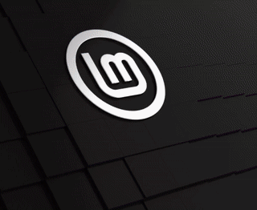

# SPC-1000

## Introduction

This is an emulator for SPC-1000 ([https://en.wikipedia.org/wiki/SPC-1000](https://en.wikipedia.org/wiki/SPC-1000)) ported on Linux/Mac/Android device. It was branched off of Windows-based one developed and published by Ionique at ([https://blog.naver.com/ionique/10015262896](https://blog.naver.com/ionique/10015262896)).

## Snapshots

on Android:


on Linux:


on Mac:


## Supporting tape-based DOS
The latest version supports disk-like operations using cassette tape I/O. Check out the demo:

[](https://youtu.be/aYlQKWCQPE0?si=LE_BQTkdAO0PlgUK)

## Requirements

To build Android apk, you need:
- JDK and JRE 8
- Android SDK and NDK (with Android Build-tools 28.0.3 and Android Platform API 28, though these are configurable)
- ANDROID_HOME and ANDROID_NDK_HOME environment variables set (or create `local.properties` as instructed by gradle when building)
- Android device (> SDK version 19, Lollipop)

## How to build

On Android:

```
./get_dependencies  # SDL
cd android
./gradlew assembleDebug
./gradlew installDebug
```

with IDE (as of Android Studio 3.2.1): first download the dependencies (SDL2) as above, or manually like below. Then open the ./android folder as an existing project in Android Studio.

on Linux/Mac, you need `cmake/libsdl2-dev/z80asm`. Install them via one of the package managers available on your platform. And then:

```
./build.sh
```

## Downloading dependencies manually

Download the latest source release from SDL website:

https://www.libsdl.org/download-2.0.php

Unzip it, put the SDL2-x.x.x folder in `external/SDL2` and rename them to SDL2 so your project folder looks like this:
```
+ android
+ external
| + SDL2
| | + Android.mk
| | | SDL2
```

## Credits

- [https://blog.naver.com/ionique/10015262896](https://blog.naver.com/ionique/10015262896) Base emulator code
- [https://github.com/pvallet/hello-sdl2-android](https://github.com/pvallet/hello-sdl2-android) Android SDL2 template
- [http://www.old-computers.com/museum/computer.asp?st=1&c=803](http://www.old-computers.com/museum/computer.asp?st=1&c=803) Image used for the launcher icon
